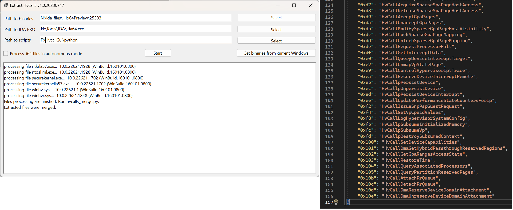

C# utility Extract.Hvcall tools for automatically Hyper-V hypercalls names and codes extraction from next Windows binaries:

	winhvr.sys
	winhv.sys
	securekernel.exe
	ntoskrnl.exe
	
additionally can be added
 
	securekernella57.exe
	ntkrla57.exe

Tool uses IDA PRO for binary analysis. You can specify path to IDA PRO and folder with Hyper-V binaries in config.json directory or point it in GUI interface.

Based on .Net Core 6.0

1. Download fresh version of idahunt plugin (https://github.com/nccgroup/idahunt) and place it in the directory with Extract.Hvcalls directory - idahunt can be used in some cases for disassembling binaries.
2. Install python plugins

pip install:
 sark
 pefile

3. Run Extract.Hvcalls.exe
4. Select path to Windows binaries and IDA PRO
5. Click 'Start' button. Waiting, until IDA PRO finished script processing

"Process .idb with python script" option can be used if you already has early analyzed IDA-databased for mentioned binaries.
"Get binaries from current Windows" option allows copy files from current Windows directory to binaries folder for future analysis.

You can see resulting json files inside "result" directory:
	hvcalls_results.json - list of Hyper-V hypercalls
	hvcalls_unknown.json - list of hypercalls name with unknown Hypercall code (you need do manual analysis for it)